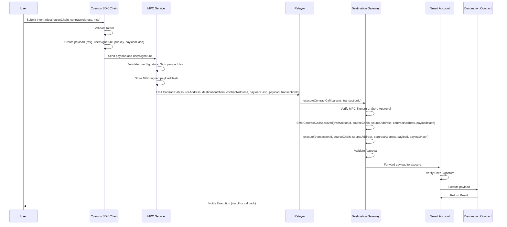

## Synopsis

This standard document specifies the packet data structure, state machine handling logic, and encoding details for implementation of Gateway contracts.

## Motivation

Gateway is a crucial component for facilitating cross-chain communication within the Interchain Auth protocol. It acts as an intermediary, enabling secure and verifiable message passing between different blockchain networks. The Gateway ensures that transactions originating from one chain can be accurately and securely processed on another, maintaining data integrity and trust across disparate environments.

This protocol establishes a unified communication mechanism that operates seamlessly across various blockchain networks. With Gateway, applications on one chain can securely interact with contracts and functionalities on other chains, ensuring that cross-chain interactions are both secure and verifiable. This approach minimizes reliance on trust-based intermediaries, enabling users to engage with decentralized applications and assets distributed across multiple blockchains, fostering interoperability and scalability within the broader blockchain ecosystem.

## Definitions

- `Gateway`: A smart contract that facilitates secure and verifiable message passing between different blockchain networks.
- `GMP Module`: The module that builds GMP (General Message Passing) messages with the user's signatures.
- `MPC`: Multi-Party Computation, a cryptographic service that validates and signs cross-chain messages.
- `Relayer`: An entity responsible for transmitting approved messages between chains.
- `Smart Account`: A contract that receives and executes the cross-chain payload on the destination chain.
- `Verifier`: A contract responsible for validating MPC signatures and transaction authenticity.

## Desired Properties

- `Permissionless`: No changes are required to integrate. Each distinct network needs to stand on its own, and no internal changes need to be required to any such network to connect it.
- `Modular`: The Gateway specifies the messages semantics for receiving messages and Verifier specifies the validation rules that are applied to provide safety. Verifier contract logic may be upgraded or improved without requiring any interface changes, as the applications only need to speak to the Gateway.

## Technical Specification

### General Design

A chain that integrates GMP Module can send messages to other chains through the Gateway. The Gateway ensures the integrity and authenticity of these messages before processing them on the destination chain.

This specification details the workflow for executing cross-chain transactions through the Gateway. Users initiate the process by submitting GMP messages on the Sending Chain, which are then sent to the MPC service for signing. The MPC service validates the user's signature and signs the payload hash. Once signed, the MPC service submits the signed payload to the Gateway for approval and execution. Upon receipt, the Gateway Contract processes the request by verifying the MPC signature before executing the transaction. This process ensures secure and verifiable cross-chain interactions, leveraging cryptographic proof to maintain the integrity of the transaction.



### Data Structures

Gateway Contract is a smart contract that receives and processes cross-chain messages.

```typescript
interface Gateway {
    private approvedCalls: Map<string, boolean>; // mapping of transaction key to approval status
    private executedCalls: Map<string, boolean>; // mapping of transaction key to execution status
    private verifierAddress: string; // verifier contract address
    private entryPointAddress: string; // smart account entrypoint contract address
    private ownerAddress: string; // Owner address of the Gateway contract
    private mpcPublicKey: string; // Public key of the MPC service for signature verification
}
```

### Sub-protocols

#### Gateway Contract

`Gateway Contract` is a smart contract that acts as the communication channel for cross-chain messages. It receives transaction payloads from the sending chain, which include the execution payload, MPC signature, user's signature, and other message semantics. The Gateway validates these inputs through a Verifier contract and forwards valid payloads to the Smart Account contract for execution.

```typescript
interface ContractCallParams {
    transactionId: string; // Unique identifier for the cross-chain transaction
    sourceChain: string; // Identifier of the chain where the transaction originated
    sourceAddress: string; // Address of the sender on the source chain
    mpcSignature: string; // Signature from the MPC service (Hex string)
    destinationChain: string; // Identifier of the target chain
    destinationAddress: string; // Address of the contract to call on the destination chain
    payload: string; // Encoded call data to be executed (Hex string)
    payloadHash: string; // Hash of the payload for verification (Hex string)
}

interface ContractCallApprovedEvent {
    transactionId: string;
    sourceChain: string;
    sourceAddress: string;
    destinationAddress: string;
    payloadHash: string;
}

interface ContractCallExecutedEvent {
    transactionId: string;
    sourceChain: string;
    sourceAddress: string;
    destinationAddress: string;
    payloadHash: string;
}

class GatewayContract {
    private executedCalls: Map<string, boolean> = new Map();
    private verifierAddress: string;
    private entryPointAddress: string;
    private ownerAddress: string;

    constructor(ownerAddress: string, entryPointAddress: string, verifierAddress: string) {
        this.ownerAddress = ownerAddress;
        this.entryPointAddress = entryPointAddress;
        this.verifierAddress = verifierAddress;
    }

    // Approve a cross-chain contract call
    async approveContractCall(params: ContractCallParams): Promise<boolean> {
        const { transactionId, sourceChain, sourceAddress, destinationAddress, payloadHash, mpcSignature } = params;

        // Generate unique key for this transaction
        const key = this.generateKey(params);

        // Check if already approved
        if (this.approvedCalls.get(key)) {
            return true; // Already approved
        }

        // Call Verifier to validate MPC signature
        const verifier = new Verifier(this.verifierAddress);
        const isValidSignature = await verifier.validateMPCSignature(payloadHash, mpcSignature);
        if (!isValidSignature) {
            return false;
        }

        // Mark as approved
        this.approvedCalls.set(key, true);

        // Emit ContractCallApproved event
        this.emitEvent<ContractCallApprovedEvent>("ContractCallApproved", {
            transactionId,
            sourceChain,
            sourceAddress,
            destinationAddress,
            payloadHash,
        });

        return true;
    }

    // Execute a contract call (called by relayer)
    async executeContractCall(params: ContractCallParams): Promise<void> {
        const { transactionId, sourceChain, sourceAddress, destinationAddress, payload, payloadHash } = params;

        // Generate unique key for this transaction
        const key = this.generateKey(params);

        // Check if already executed to prevent replay attacks
        if (this.executedCalls.get(key)) {
            throw new Error("Transaction already executed");
        }

        // Ensure transaction is approved
        const isApproved = await this.approveContractCall(params);
        if (!isApproved) {
            throw new Error("Transaction not approved");
        }

        // Verify payload hash to ensure data integrity
        const computedHash = keccak256(payload);
        if (computedHash !== payloadHash) {
            throw new Error("Invalid payload hash");
        }

        // Mark transaction as executed to prevent replay
        this.executedCalls.set(key, true);

        // Forward payload to smart account for execution
        const success = await this.callSmartAccount(destinationAddress, payload);
        if (!success) {
            throw new Error("Smart account execution failed");
        }

        // Emit ContractCallExecuted event for tracking
        this.emitEvent<ContractCallExecutedEvent>("ContractCallExecuted", {
            transactionId,
            sourceChain,
            sourceAddress,
            destinationAddress,
            payloadHash,
        });
    }

    // Update Verifier address (for upgradability)
    async updateVerifier(address: string): Promise<void> {
        if (!this.isOwner()) {
            throw new Error("Only owner can update verifier");
        }
        this.verifierAddress = address;
    }

    // Helper: Generate unique key for approval/executed mapping
    private generateKey(params: ContractCallParams): string {
        const { transactionId, sourceChain, sourceAddress, destinationChain, destinationAddress, payloadHash } = params;

        // Create a unique key using essential transaction parameters
        // Note: We exclude mpcSignature to allow different signatures for the same transaction
        return keccak256(
            JSON.stringify({
                transactionId,
                sourceChain,
                sourceAddress,
                destinationChain,
                destinationAddress,
                payloadHash,
            })
        );
    }

    // Helper: Call smart account to execute the payload
    private async callSmartAccount(destinationAddress: string, payload: string): Promise<boolean> {
        // Pseudo-code: Call smart account's executePayload function
        // In a real implementation, use ethers.js or similar to call contract
        try {
            // Call the EntryPoint contract which will route to the appropriate smart account
            await callContract(this.entryPointAddress, "executePayload", [destinationAddress, payload]);
            return true;
        } catch (error) {
            console.error("Smart account execution failed:", error);
            return false;
        }
    }

    // Helper: Simulate event emission
    private emitEvent<T>(eventName: string, data: T): void {
        console.log(`Event ${eventName}:`, data); // Placeholder for event emission
    }

    private isOwner(): boolean {
        return this.ownerAddress === this.sender;
    }
}
```

### Verifier Contract

Verifier contract is responsible for validating the MPC signature and transaction ID. It ensures that the signature is valid and the transaction ID is unique.

```typescript
class Verifier {
    private mpcPublicKey: string; // Hex string
    private ownerAddress: string;

    constructor(mpcPublicKey: string, ownerAddress: string) {
        this.mpcPublicKey = mpcPublicKey;
        this.ownerAddress = ownerAddress;
    }

    // Validate MPC signature
    async validateMPCSignature(payloadHash: string, mpcSignature: string): Promise<boolean> {
        // Verify threshold signature (e.g., BLS or Schnorr)
        const signer = await this.recoverSigner(payloadHash, mpcSignature);
        return this.verifyThresholdSignature(signer, this.mpcPublicKey);
    }

    // Update MPC public key (for upgradability)
    async updateMPCPublicKey(newPublicKey: string): Promise<void> {
        if (!this.isOwner()) {
            throw new Error("Only owner can update public key");
        }
        this.mpcPublicKey = newPublicKey;
    }

    // Helper: Verify threshold signature (pseudo-code)
    private async verifyThresholdSignature(signer: string, publicKey: string): Promise<boolean> {
        // Implement TSS verification (e.g., BLS or Schnorr)
        // Placeholder: assumes signature verification logic
        return true;
    }

    // Helper: Recover signer from signature (pseudo-code)
    private async recoverSigner(hash: string, signature: string): Promise<string> {
        // Implement signature recovery for TSS
        // Placeholder: returns signer address
        return "0x0"; // Replace with actual recovery logic
    }

    // Helper: Check if caller is owner (placeholder)
    private isOwner(): boolean {
        return this.ownerAddress === this.sender;
    }
}
```

## Example Implementations

- GMP Module [Go Implementation](https://github.com/s16rv/sourdough/tree/main/x/gmp)
- Gateway [Solidity Implementation](https://github.com/s16rv/sourdough-solidity-contracts/tree/main/contracts/gateway)

## History

July 9, 2025 - Draft written

## Copyright

All content herein is licensed under [Apache 2.0](https://www.apache.org/licenses/LICENSE-2.0).
