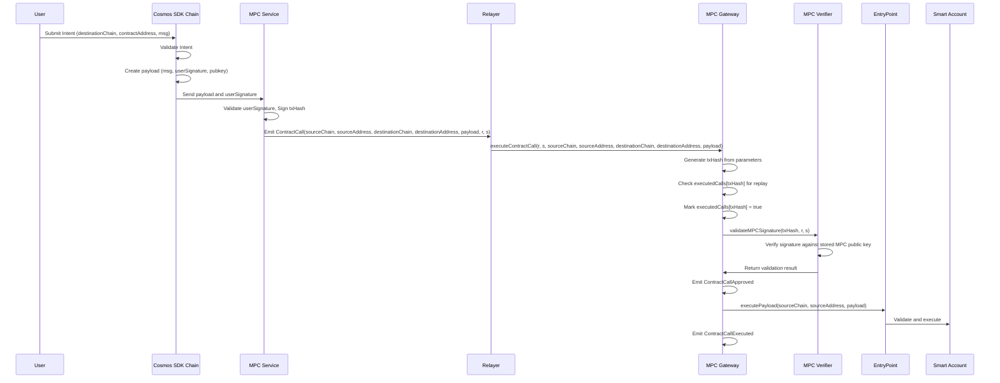

## Synopsis

This document specifies the packet data structure, state machine handling logic, and encoding details for implementation of the MPC Gateway contracts.

## Motivation

The MPC Gateway is a crucial component for facilitating cross-chain communication within the Interchain Auth protocol. It acts as an intermediary, enabling secure and verifiable message passing between different blockchain networks. The Gateway ensures that transactions originating from one chain can be accurately and securely processed on another, maintaining data integrity and trust across disparate environments.

This protocol establishes a unified communication mechanism that operates seamlessly across various blockchain networks. With the MPC Gateway, applications on one chain can securely interact with contracts and functionalities on other chains, ensuring that cross-chain interactions are both secure and verifiable.

## Definitions

- `MPC Gateway`: A smart contract that validates MPC signatures and forwards payloads to the EntryPoint for execution.
- `MPC Verifier`: A separate contract responsible for storing the MPC public key and validating MPC signatures.
- `GMP Module`: The module that builds GMP (General Message Passing) messages with the user's signatures on the source chain.
- `MPC`: Multi-Party Computation, a cryptographic service that validates and signs cross-chain messages.
- `Relayer`: An entity responsible for transmitting approved messages between chains.
- `EntryPoint`: A contract that receives payloads from the Gateway and routes them to user Accounts.
- `Smart Account`: A contract that receives and executes the cross-chain payload on the destination chain.

## Desired Properties

- `Permissionless`: No changes are required to integrate. Each distinct network needs to stand on its own.
- `Modular`: The Gateway handles message routing while the Verifier handles signature validation. The Verifier can be upgraded independently.
- `Replay Protection`: Each transaction can only be executed once, tracked via `executedCalls` mapping.

## Technical Specification

### General Design

A chain that integrates GMP Module can send messages to other chains through the MPC Gateway. The Gateway ensures the integrity and authenticity of these messages before processing them on the destination chain.

```
┌──────────────┐     ┌─────────────┐     ┌─────────────┐     ┌────────────┐     ┌─────────┐
│ Source Chain │ --> │ MPC Service │ --> │ MPC Gateway │ --> │ EntryPoint │ --> │ Account │
└──────────────┘     └─────────────┘     └─────────────┘     └────────────┘     └─────────┘
                            │                   │
                            │                   v
                            │            ┌──────────────┐
                            └----------> │ MPC Verifier │
                                         └──────────────┘
```

### Sequence Diagram


```mermaid
sequenceDiagram
    participant User
    participant CosmosSDK as Cosmos SDK Chain
    participant MPC as MPC Service
    participant Relayer
    participant Gateway as MPC Gateway
    participant Verifier as MPC Verifier
    participant EntryPoint
    participant Account as Smart Account

    User->>CosmosSDK: Submit Intent (destinationChain, contractAddress, msg)
    CosmosSDK->>CosmosSDK: Validate Intent
    CosmosSDK->>CosmosSDK: Create payload (msg, userSignature, pubkey)
    CosmosSDK->>MPC: Send payload and userSignature
    MPC->>MPC: Validate userSignature, Sign txHash
    MPC->>Relayer: Emit ContractCall(sourceChain, sourceAddress, destinationChain, destinationAddress, payload, r, s)
    Relayer->>Gateway: executeContractCall(r, s, sourceChain, sourceAddress, destinationChain, destinationAddress, payload)
    Gateway->>Gateway: Generate txHash from parameters
    Gateway->>Gateway: Check executedCalls[txHash] for replay
    Gateway->>Gateway: Mark executedCalls[txHash] = true
    Gateway->>Verifier: validateMPCSignature(txHash, r, s)
    Verifier->>Verifier: Verify signature against stored MPC public key
    Verifier->>Gateway: Return validation result
    Gateway->>Gateway: Emit ContractCallApproved
    Gateway->>EntryPoint: executePayload(sourceChain, sourceAddress, payload)
    EntryPoint->>Account: Validate and execute
    Gateway->>Gateway: Emit ContractCallExecuted
```

### Data Structures

#### MPC Gateway Contract

```solidity
interface IMPCGateway {
    // Errors
    error TransactionAlreadyExecuted();
    error TransactionNotApproved();
    error TransactionFailed();

    // Events
    event ContractCallApproved(
        string sourceChain,
        string sourceAddress,
        address destinationAddress,
        bytes32 txHash
    );

    event ContractCallExecuted(
        string sourceChain,
        string sourceAddress,
        address destinationAddress,
        bytes32 txHash
    );

    event ContractCallExecuting(
        bytes32 mpcSignatureR,
        bytes32 mpcSignatureS,
        string sourceChain,
        string sourceAddress,
        address destinationAddress
    );

    // State
    mapping(bytes32 => bool) public executedCalls;

    // Functions
    function executeContractCall(
        bytes32 mpcSignatureR,
        bytes32 mpcSignatureS,
        string calldata sourceChain,
        string calldata sourceAddress,
        string calldata destinationChain,
        address destinationAddress,
        bytes calldata payload
    ) external returns (bool);

    function generateTxHash(
        string calldata sourceChain,
        string calldata sourceAddress,
        string calldata destinationChain,
        address destinationAddress,
        bytes calldata payload
    ) external pure returns (bytes32);
}
```

#### MPC Verifier Contract

```solidity
interface IMPCVerifier {
    // Events
    event MPCPublicKeyUpdated(
        bytes32 publicKeyX,
        bytes32 publicKeyY,
        bytes32 newPublicKeyX,
        bytes32 newPublicKeyY
    );

    // State (in implementation)
    // bytes32 public publicKeyX;
    // bytes32 public publicKeyY;
    // address private immutable ownerAddress;

    // Functions
    function validateMPCSignature(
        bytes32 payloadHash,
        bytes32 r,
        bytes32 s
    ) external view returns (bool);

    function updateMPCPublicKey(
        bytes32 newPublicKeyX,
        bytes32 newPublicKeyY
    ) external; // onlyOwner
}
```

### Sub-protocols

#### executeContractCall

The main entry point for cross-chain message execution.

```
1. Emit ContractCallExecuting event (for debugging/monitoring)
2. Generate txHash = sha256(sourceChain, sourceAddress, destinationChain, destinationAddress, payload)
3. Check executedCalls[txHash] - revert if already executed (replay protection)
4. Mark executedCalls[txHash] = true
5. Call _approveContractCall to validate MPC signature
6. If approved, call EntryPoint.executePayload(sourceChain, sourceAddress, payload)
7. Emit ContractCallExecuted event
```

#### _approveContractCall (internal)

Validates the MPC signature against the transaction hash.

```
1. Call verifier.validateMPCSignature(txHash, r, s)
2. If valid, emit ContractCallApproved event
3. Return validation result
```

#### generateTxHash

Creates a unique identifier for each transaction to prevent replay attacks.

```solidity
function generateTxHash(...) public pure returns (bytes32) {
    return sha256(abi.encode(
        sourceChain,
        sourceAddress,
        destinationChain,
        destinationAddress,
        payload
    ));
}
```

The txHash includes:
- `sourceChain`: Origin chain identifier (chain binding)
- `sourceAddress`: Sender address on source chain (source binding)
- `destinationChain`: Target chain identifier (chain binding)
- `destinationAddress`: Target contract (EntryPoint) address
- `payload`: Encoded execution data

### Security Considerations

#### Replay Protection

- `executedCalls[txHash]` mapping prevents the same transaction from being executed twice
- txHash is computed from all relevant parameters including chains and payload

#### Chain Binding

- Both `sourceChain` and `destinationChain` are included in txHash
- MPC signature covers the txHash, binding the signature to specific chains

#### MPC Key Management

- MPC public key can be rotated by the owner via `updateMPCPublicKey`
- Key rotation emits `MPCPublicKeyUpdated` event for transparency

### Known Limitations

- Debug events (`DebugTxHash`, `DebugError`) should be removed for production
- No admin functionality on MPCGateway itself (cannot update verifier address after deployment)

## Example Implementations

- GMP Module [Go Implementation](https://github.com/s16rv/sourdough/tree/main/x/gmp)
- MPC Gateway [Solidity Implementation](https://github.com/s16rv/sourdough-solidity-contracts/tree/main/contracts/mpc-gateway)

## History

- July 9, 2025 - Draft written
- January 30, 2026 - Updated to reflect current implementation (removed approvedCalls, updated interfaces, added MPC Verifier details)

## Copyright

All content herein is licensed under [Apache 2.0](https://www.apache.org/licenses/LICENSE-2.0).
